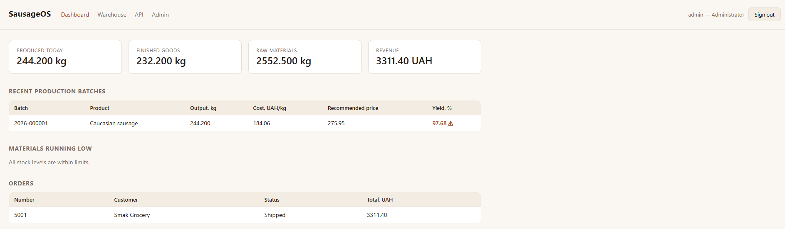
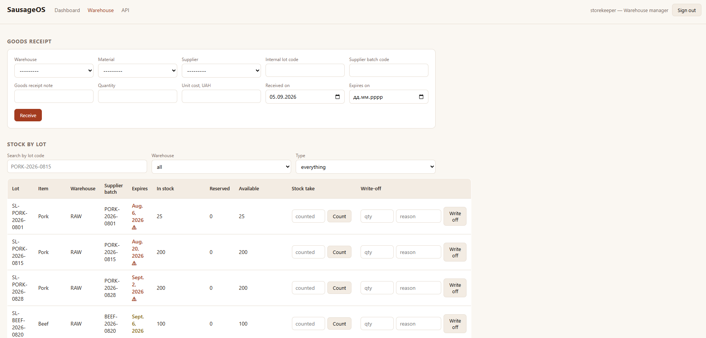

# sausageos

[](https://github.com/patseluk-lang/sausageos/actions/workflows/ci.yml)

A production management system for a **craft meat workshop**: raw materials →
versioned recipes → production batches → stock → finished goods → orders → actual
cost → traceability. Not a CRUD demo — the domain rules are the point.

Django 5.2 + DRF + PostgreSQL 16, with Celery on Redis for scheduled checks,
Docker Compose for the full stack and GitHub Actions running the suite on
PostgreSQL. Business logic lives in `services.py` per app; the HTTP layer only
validates input and calls it, so the REST API, the HTMX screens and a management
command all execute the same code path.

The domain is not invented. The author runs a craft sausage production and wrote
the rules the way a food technologist applies them: yield norms, technological
losses, batch aging, HACCP-style recall.

## The problems this solves

**An average price hides the truth.** Pork was bought at 165, then 172, then 181
UAH/kg. A batch that consumed the first two lots did not cost the average — it
cost 100 × 165 + 75 × 172 = 29,400 UAH. This system charges every batch with the
price of the lots it actually consumed, so the margin you report is the margin
you earned.

**A recipe that changes rewrites history.** If version 2.0 replaces 1.0 in place,
every batch produced under the old formula silently starts reporting the new one.
Here `ACTIVE` and `ARCHIVED` versions are locked at model level, and a batch
references its version forever.

**A stock field can be edited; a ledger cannot.** There is no `quantity` column
to adjust. The balance is the sum of an append-only `StockMove` table, and
`StockMove.save()` refuses to update an existing row — corrections are new moves,
so every number can be traced back to the operation that produced it.

**Two managers, one pallet of pork.** Reserving reads the balance and immediately
changes it. Without row locks two parallel requests both see 300 kg free and both
book 200. This is not theoretical — removing `lock=True` from the reservation
service and re-running the suite gives:

```
FAILED tests/test_concurrency.py::test_reserve_locks_rows_before_reading_stock
FAILED tests/test_concurrency.py::test_parallel_reservations_do_not_oversell
    assert ['ok', 'ok'] == ['ok', 'rejected']
```

**A contaminated delivery has to be found in hours, not days.** Given a supplier
batch code, the system walks forward to every production batch, finished lot,
order and customer affected, and reports the total quantity at risk.

## Screenshots

Analytical dashboard — cost and recommended price computed from the lots actually
consumed; the 97.68 % yield is flagged because the recipe norm is 98–99 %.



Warehouse workspace — goods receipt, lot search, stock take and write-off without
touching the admin. "In stock / Reserved / Available" shows what production has
already locked; expiry dates are highlighted a week ahead.



## Quick start

### Docker (PostgreSQL + Redis + Celery)

```bash
cp .env.example .env
docker compose up --build -d
docker compose exec web python manage.py migrate
docker compose exec web python manage.py seed_demo
```

### Local (SQLite, no Docker)

With `POSTGRES_DB` unset the project runs on SQLite.

```bash
python -m venv .venv
source .venv/bin/activate        # Linux, macOS
.\.venv\Scripts\Activate.ps1     # Windows PowerShell

pip install -r requirements-dev.txt
python manage.py migrate
python manage.py seed_demo
python manage.py runserver
```

`seed_demo` runs the whole cycle — receipts, reservation, production, costing,
order, shipment — and creates five users, one per role, password `demo12345`:
`admin`, `technologist`, `storekeeper`, `accountant`, `sales`.

| URL | Purpose |
|---|---|
| `/accounts/login/` | Sign in |
| `/` | Analytical dashboard |
| `/warehouse/` | Warehouse workspace (HTMX) |
| `/admin/` | Django admin |
| `/api/docs/` | Swagger UI |
| `/api/schema/` | OpenAPI schema |

## How it works

### Catalog

`Supplier`, `Material`, `Product`. The purchase price is **not** stored on the
material: it changes with every delivery, so price, expiry date and supplier batch
code belong to the stock lot. The catalog keeps only what is stable — name, SKU,
unit, minimum stock, category, default supplier.

### Versioned recipes

`Recipe` → `RecipeVersion` → `RecipeLine`. A line is either a percentage of batch
weight (meat) or a quantity per 100 kg (spices, casing, packaging). Activating a
version archives the previous one; locked versions raise `ValidationError` on any
attempt to edit their lines.

### Production cycle

```
create_batch → reserve_materials → start → finish
   PLANNED   →     RESERVED      → IN_PROGRESS → DONE
```

The recipe is exploded against the planned quantity (250 kg × 70 % = 175 kg of
pork), stock is checked, and a shortage is reported rather than silently ignored:

```json
{"detail": "Cannot start production. Not enough — Pork: 50.000 kg"}
```

### Stock

Lot-level accounting, FEFO allocation by expiry date, reservations that lower
availability without touching the balance, write-offs, transfers between
warehouses, stock takes, and a below-minimum report. Balances are aggregated in
the database with a single subquery — a regression test asserts one query, because
the naive version cost 1,537 queries on 512 lots.

### Concurrency

`inventory.lock_lots()` takes `SELECT ... FOR UPDATE` on the lots of one item
until the transaction ends, and the balance is read only after the lock is held.
Locks are acquired in a single query ordered by `pk` — the same order for every
transaction, which rules out deadlocks. Write-offs, transfers and stock takes lock
their lot the same way.

SQLite has no row-level locking, so three concurrency tests skip there and run on
PostgreSQL in CI, including a genuinely parallel one with two threads.

### Costing

`GET /api/production/batches/{id}/cost/`:

```json
{
  "by_category": {"Raw material": "44025.00", "Spices": "240.00",
                  "Casing": "195.00", "Packaging": "160.00"},
  "total_cost": "44620.00",
  "produced_quantity": "244.200",
  "cost_per_kg": "182.72",
  "target_margin": "33.30",
  "recommended_price": "273.94",
  "yield_percent": "97.68",
  "loss_quantity": "5.800",
  "yield_norm": "98.00–99.00%",
  "yield_below_norm": true
}
```

### Yield and losses

The norm lives on the recipe version (`yield_min`, `yield_max`). The yield base is
the meat raw material only — spices, casing and packaging are excluded. Loaded
250 kg, produced 244.2 kg → 97.68 %, below the 98–99 % norm, and flagged as such.

### Traceability and recall

Forward (`GET /api/traceability/recall/PORK-2026-0815/`): supplier batch → stock
lots → production batches → finished lots → orders → customers, with the total
`affected_quantity`. Backward (`GET /api/traceability/lot/FG-2026-000147/`):
finished lot → batch → recipe version → every material consumed → supplier batches
→ goods receipt notes. Every recall is written to the audit log.

### Orders

`NEW → CONFIRMED → RESERVED → PAID → PROCESSING → SHIPPED → COMPLETED`, with
cancellation allowed until shipment; transitions are validated against an explicit
table. Finished goods are reserved by FEFO, and shipping issues exactly the
reserved lots — which is what keeps the customer↔lot link intact for recall.

### Warehouse workspace

Django Templates + HTMX (htmx 2.0.4 from CDN; for an offline workshop, vendor the
file and change one tag in `templates/base.html`).

| Action | Behaviour |
|---|---|
| Goods receipt | Form → `inventory.receive()`; the response carries `HX-Trigger: lotsChanged` and the stock table reloads itself |
| Lot search | `keyup changed delay:300ms` over lot code and supplier batch code |
| Stock take | Counted quantity in the row → `inventory.stock_take()` posts an `ADJUST` move and swaps just that row |
| Write-off | Quantity + reason → `inventory.write_off()`; writing off more than available returns 400 into the same row |

Only `WAREHOUSE_MANAGER` (and `ADMIN`) may open it. The views hold no business
logic — they call the same services as the REST API.

### Roles and audit

`ADMIN`, `PRODUCTION_MANAGER`, `WAREHOUSE_MANAGER`, `ACCOUNTANT`, `SALES_MANAGER`.
`RoleBasedPermission` grants read to any authenticated user and write only to the
roles listed on the viewset: a storekeeper cannot open production batches, a
technologist cannot edit the material catalog. Every business action is recorded
in `AuditLog` with its actor and payload (`GET /api/audit/`).

Sign-in and sign-out are the project's own (`registration/login.html`), not the
admin's — four of the five roles have no admin access at all.

## API

| Method | Endpoint | Purpose |
|---|---|---|
| POST | `/api/token/`, `/api/token/refresh/` | JWT |
| GET/POST | `/api/suppliers/`, `/api/materials/`, `/api/products/` | Catalog |
| GET/POST | `/api/recipes/`, `/api/recipe-versions/` | Recipes |
| POST | `/api/recipe-versions/{id}/activate/` | Activate a version |
| GET/POST | `/api/lots/`, `/api/moves/` | Lots and stock moves |
| POST | `/api/lots/receive/` | Goods receipt |
| GET | `/api/inventory/`, `/api/inventory/low-stock/` | Balances, shortages |
| GET/POST | `/api/production/batches/` | Production batches |
| GET | `/api/production/batches/{id}/requirements/` | Material requirements |
| GET | `/api/production/batches/{id}/availability/` | Stock check |
| POST | `/api/production/batches/{id}/reserve/`, `/start/`, `/finish/`, `/cancel/` | Production cycle |
| GET | `/api/production/batches/{id}/cost/` | Actual cost |
| GET/POST | `/api/customers/`, `/api/orders/` | Sales |
| POST | `/api/orders/{id}/confirm/`, `/reserve/`, `/pay/`, `/process/`, `/ship/`, `/complete/`, `/cancel/` | Order status |
| GET | `/api/reports/profitability/`, `/api/reports/dashboard/` | Analytics |
| GET | `/api/traceability/recall/{supplier_batch_code}/` | Recall |
| GET | `/api/traceability/lot/{lot_code}/` | Backward traceability |
| GET | `/api/audit/` | Audit log |

```bash
TOKEN=$(curl -s -X POST localhost:8000/api/token/ \
  -H "Content-Type: application/json" \
  -d '{"username":"technologist","password":"demo12345"}' | python -c "import sys,json;print(json.load(sys.stdin)['access'])")

curl -s localhost:8000/api/traceability/recall/PORK-2026-0815/ -H "Authorization: Bearer $TOKEN"
```

## Layout

```
config/            settings, celery, urls
apps/core          users, roles, audit log, business exceptions, permissions
apps/catalog       suppliers, materials, finished products
apps/recipes       recipes and their versions
apps/inventory     lots, stock moves, reservations, FEFO, Celery tasks
apps/production    batches, consumption, yield, costing
apps/sales         customers, orders, shipment
apps/traceability  recall and backward traceability
apps/api           DRF serializers, viewsets, routes, exception handler
apps/dashboard     analytical dashboard and warehouse workspace
tests/             62 tests
```

## Scheduled tasks (Celery)

| Task | Schedule | Action |
|---|---|---|
| `inventory.check_low_stock` | daily 07:00 | materials below minimum stock |
| `inventory.check_expiring_lots` | daily 07:10 | lots expiring within 7 days |
| `production.recalculate_batch_cost` | on demand | recompute a batch cost |
| `production.check_yield_deviations` | on demand | batches below the yield norm |

## Tests

```bash
pytest                # 62 tests (3 skip on SQLite)
ruff check .          # lint
```

CI runs lint, a migration check and the full suite against PostgreSQL 16 on every
push.

## Roadmap

- **Done:** catalog, versioned recipes, ledger-based stock, FEFO, reservations,
  production cycle, actual costing, yield control, orders, recall, REST API with
  roles, dashboard, warehouse workspace, tests, CI.
- **Next:** technologist workspace (start a batch and record output without the
  admin), printable technological and costing cards (PDF), partial shipment,
  several products from one batch.
- **Later:** order-driven production planning (MRP), purchase requests, labour and
  energy in the cost model, plan-versus-fact analysis.
- **Eventually:** scales and thermal-chamber integration, lot barcodes, mobile
  scanning, export to accounting systems.

## License

MIT — see [LICENSE](LICENSE).
